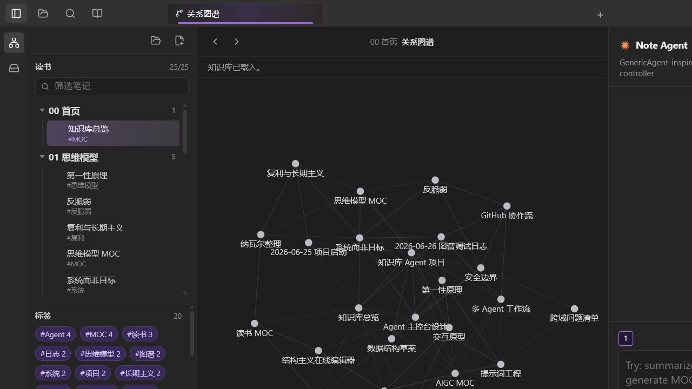
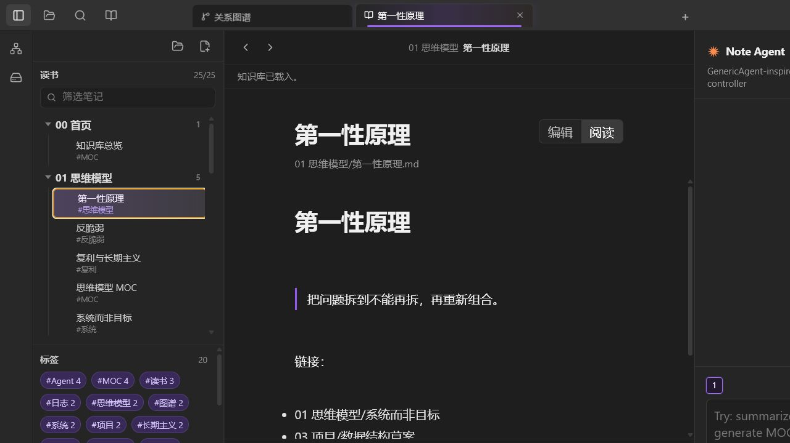
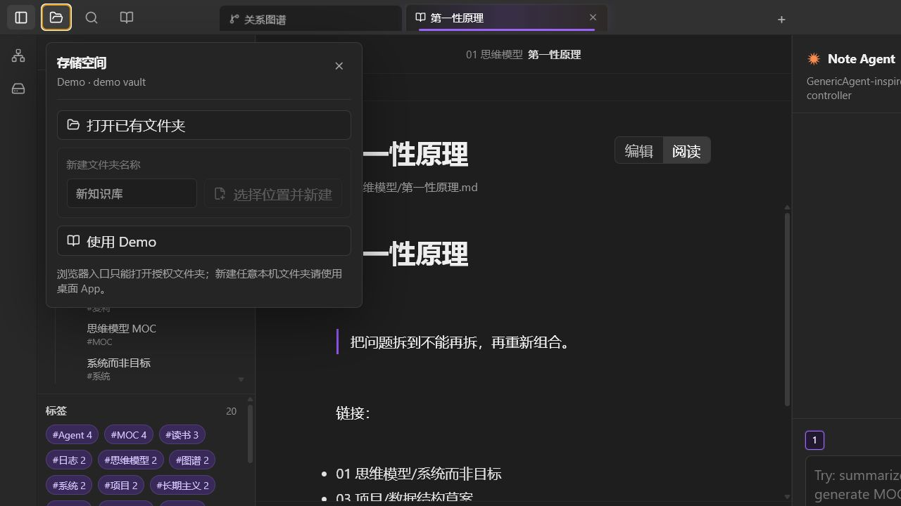

# 个人知识库 Agent

一个本地优先、以普通 Markdown 文件夹为知识库的 Windows 桌面 App。它借鉴 Obsidian 的双链和关系图谱体验，但不依赖 Obsidian：选一个文件夹，就能作为自己的知识库使用。

这不是营销页，而是可直接操作本机知识库的三栏工作台：左边是层级化文件系统，中间是笔记与关系图谱，右边是带真实上下文统计的 Note Agent。



## 你做出来的重点强化

这版 App 的重点不只是“能读 Markdown”，而是把知识库日常使用中容易卡住的地方做成了明确、可操作的工作流。

### 1. 全库关系图谱能被真正探索

- 全库图谱以笔记中的 `[[双链]]` 为关系来源，不靠预设示例关系。
- 鼠标左键拖动空白区域可平移整张图，滚轮可围绕指针平滑缩放；图谱会记住浏览状态。
- 节点有物理式分布与拖拽反馈。悬停一个节点时，无关节点和线条会淡下去，直接关联的节点与连线会被突出。
- 图谱缩小时标签会先淡化、再隐藏；放大到可读范围后再显示，避免小窗口或大库里出现一团不可读的字。
- 可以把节点拖到图谱内的垃圾桶，但删除仍会进入受确认的回收流程，不会立刻销毁磁盘文件。

### 2. 左侧不是普通列表，而是可理解的文件结构

- 文件树保持真实文件夹的上下级结构，可展开、折叠、筛选，并按层级区分文件夹与笔记的视觉权重。
- 在笔记或文件夹上右键，可以新建、重命名、复制、剪切与删除；这些操作作用于当前知识库会话。
- 顶部标签页保留已浏览笔记，像浏览器一样在多个上下文间切换。

### 3. 笔记、局部关系与 Agent 同屏协作



- 打开笔记后，中间栏专注于阅读或编辑；底部/侧边的微缩关系图持续标出当前笔记在关系中的位置。
- 右侧 Note Agent 可以独立承接当前笔记上下文。底部的百分比不是装饰，而是根据聊天记录、当前笔记、手动加入的笔记和 vault 概览估算的实际上下文用量。
- `+` 新建的是一个独立子 Agent 会话；编号用于在会话间切换。刷新会保存快照，回溯会恢复最近的聊天内容与上下文。
- Agent 的文件操作通过受控 App 工具执行，例如打开笔记、创建草稿、整理、建链、生成 MOC、切换图谱。它不会因为一句自然语言而偷偷调用预设答案或绕过权限流程。

### 4. 本机文件夹与安全写回分层处理



- 桌面端可以打开已有知识库文件夹，也可以选择任意位置新建知识库文件夹，并记住最近一次打开的位置。
- 新建、编辑、重命名和删除会先进入“待写回改动”层；在改动面板检查文件清单、diff 与安全摘要后，才会写入真实磁盘。
- 删除会进入 vault 内的 `.knowledge-agent-trash` 回收站，保留 30 天并按真实时间自动清理。恢复需要经过 Agent 审核与用户确认。
- `.git`、`.obsidian`、`.env`、`secret`、`token`、密码、账号等敏感路径默认被排除，不能进入正常写回或提交清单。

## 快速开始

1. 在 [GitHub Releases](https://github.com/yrupeechalco-cell/personal-knowledge-agent-generic-agent-base/releases) 下载最新 Windows 安装包。
2. 启动 `个人知识库 Agent`，点击左上角文件夹图标，选择“打开已有文件夹”或“选择位置并新建”。
3. 使用左侧文件树或中间图谱打开笔记。先用 Demo 体验也可以，Demo 不会上传你的内容。
4. 点击右侧 Agent 的设置图标，在弹出的设置窗口中选择模型、模式，并在首次使用在线模型时填入自己的 API Key。
5. 让 Agent 生成提案或手动修改笔记；打开“改动与回收站”确认 diff 后，才写回本机文件夹。

更完整的流程、交互说明和边界见 [使用指南](docs/USAGE_GUIDE.md)。

## 平台与边界

- 正式日用入口：Windows 桌面 App（Tauri + React）。
- 浏览器入口：用于预览与本地读取测试。浏览器只能在用户手动授权后读取文件夹，不能像桌面端一样在任意位置创建文件夹。
- 目前默认模型连接面向 DeepSeek V4 Pro / Flash；底层有 provider 抽象，后续可接其他兼容模型。
- 不做自动上传真实 vault，也不内置任何人的 API Key。
- 多人协作、GitHub OAuth 与实时共同编辑不属于当前公开版的已完成能力。

## 隐私与安全

- 安装包和仓库都不含用户 API Key。
- API Key 仅由用户在本机填写，桌面端保存在本机 App 配置目录，不提交到 GitHub。
- 真实知识库不会自动上传；GitHub 同步需要由用户主动选择并确认安全清单。
- 公开仓库不包含个人 vault、私有项目记忆或密钥。详情见 [安装与隐私说明](docs/AGENT_INSTALL_AND_PRIVACY.md)。

## 开发

```bash
npm install
npm run dev:web       # 浏览器预览
npm run tauri:dev     # Tauri 桌面 App
npm run typecheck
npm test
npm run tauri:build   # Windows 安装包
```

## 项目结构

```text
apps/desktop       Tauri 桌面入口：本地文件、设置、模型 key、写回与 Git
apps/web           浏览器预览入口
packages/workspace 共享三栏工作台
packages/core      Markdown、wikilink、标签、图谱与安全清单解析
packages/agent     GenericAgent-inspired 笔记 Agent、工具与权限规则
packages/ui        文件树、编辑器、关系图、微缩图与 Agent console
```
