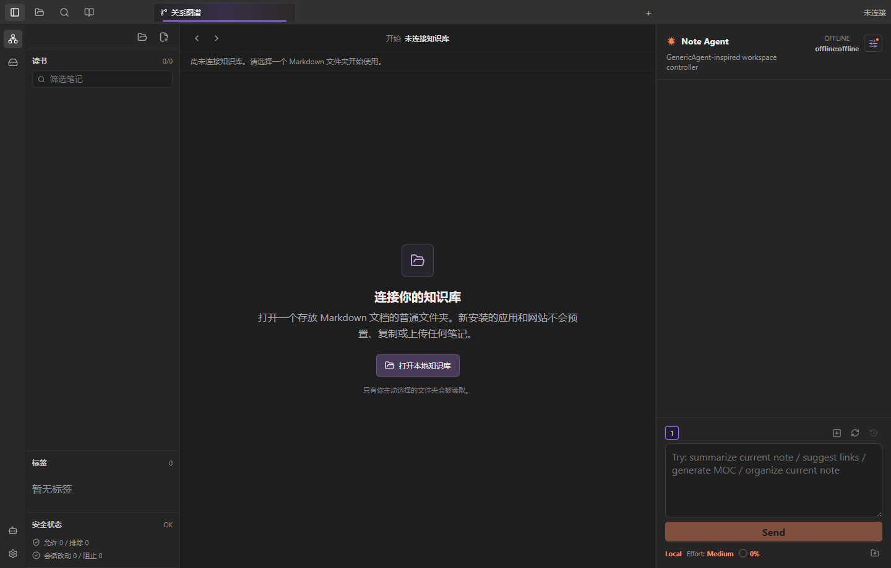

# 个人知识库 Agent

**文档语言：** [简体中文](README.md) | [English](README_EN.md)

## 中文介绍

个人知识库 Agent 是一款本地优先的 Windows 知识库应用。它直接使用普通 Markdown 文件夹，把文件管理、知识关系、笔记阅读编辑和 AI Agent 放在同一个三栏工作台中。

它借鉴了 Obsidian 的双链、图谱和本地文件理念，但与 Obsidian 相互独立。应用不要求专用数据库，也不会把笔记锁进私有格式。已有 Markdown 文件夹或 Obsidian vault 可以直接打开；离开本应用后，所有内容仍然是用户自己拥有的普通文件。

## 首次打开：零预置内容



新安装的桌面 App 和新打开的网站都从空工作区开始：

- 不附带示例笔记、测试文档或隐藏知识库。
- 不自动创建本地文件夹。
- 不自动扫描磁盘或读取用户文件。
- 不内置任何人的 API Key、聊天记录或私人配置。
- 只有用户主动选择的文件夹才会进入当前工作区。

这条规则由自动化测试约束。桌面端没有历史设置、设置读取失败或浏览器不支持文件夹选择器时，应用都必须保持 0 篇文档，不得回退到内置内容。

## 它解决什么问题

长期积累的资料通常同时存在三个困难：文件夹只能表达上下级存放关系，单纯图谱很难说明知识在项目中的作用，通用聊天工具又不了解真实文件结构和修改风险。

个人知识库 Agent 将这些问题拆成四个互补视角：

1. **文件树回答“它存在哪里”**：保留真实文件夹层级、折叠关系、筛选和标签。
2. **文件关系图回答“哪些文档明确相连”**：根据 Markdown 双链建立可追溯的全库关系。
3. **知识地形回答“它在知识体系中承担什么作用”**：按领域、问题、证据、决策和成果组织宏观视角。
4. **Note Agent 回答“接下来如何理解和推进”**：在受控工具和本地权限边界内读取上下文、提出改动并执行已授权任务。

## 连接真实文件夹


点击左上角文件夹图标即可进入存储空间。

### Windows 桌面 App

- 打开任意位置的现有 Markdown 文件夹。
- 选择磁盘位置并新建知识库文件夹。
- 记住上次连接路径，下次启动直接恢复。
- 读取本机磁盘目录结构，并以只读方式预览支持的文件。
- 对已连接知识库执行经过授权的创建、编辑、重命名、移动、删除与恢复。

### Web 版

- 通过 Chrome 或 Edge 的文件夹选择器读取用户主动授权的文件夹。
- 可以输入 `owner/repo` 或 GitHub 仓库网址，只读载入任意公开 Markdown 仓库。
- GitHub 来源会复用同一套安全过滤、文件树、双链、图谱和笔记阅读界面，但禁用新建、编辑、重命名与删除。
- 文件只在浏览器当前页面中解析，不上传到本项目服务器。
- 不具备桌面端的任意磁盘访问、系统安全存储和后台文件监听能力。
- 每次新打开网站仍从空工作区开始，不保存笔记全文作为预置内容。

### 公开示例知识库

主项目不再内置演示笔记。需要体验复杂知识图谱时，可以在“存储空间”中点击“打开官方示例知识库”，或直接访问[公开示例链接](https://personal-knowledge-agent.pages.dev/?repo=yrupeechalco-cell%2Fknowledge-agent-public-demo-vault)。

示例内容存放在独立仓库 [`knowledge-agent-public-demo-vault`](https://github.com/yrupeechalco-cell/knowledge-agent-public-demo-vault)：

- 以“复杂网络如何帮助衡量知识影响力”为主题，包含图论基础、网络模型、中心性、网络动力学、知识系统和产品实验。
- 33 篇原创中文知识笔记通过 114 条可解析双链组成复杂关系网络；连同仓库说明与许可，共载入 35 篇 Markdown。
- 外部论文、教材与 W3C 规范只提供来源链接和原创摘要，不复制受版权保护的全文。
- Web 端只读获取内容，不保存 GitHub 凭证，也不向仓库提交任何更改。
- 示例库带有静态文件清单，频繁刷新时不依赖 GitHub 匿名 API 配额；其他公开仓库没有清单时仍可自动发现默认分支。

## 三栏工作台


上图由 Web 版实时只读加载独立 GitHub 示例仓库生成，展示 35 篇 Markdown、八个知识领域和 24 条跨域依据。示例内容不在网站构建产物、Windows 安装包或运行时源码中；普通主站网址仍从零内容工作区开始。

### 左侧：文件、标签与安全状态

左侧文件树严格对应真实文件夹和 Markdown 文件：

- 文件夹可折叠，父子层级保持清楚。
- 大文件夹与高权重结构更醒目，小文档使用紧凑字号。
- 支持按标题和路径筛选笔记。
- 支持右键新建、重命名、复制、剪切、粘贴和删除。
- 标签区统计实际标签数量，不生成虚假的分类。
- 安全状态显示允许、排除和会话改动数量。

文件树负责存储结构，不与知识图谱争夺同一种表达任务。

### 中间：知识地形与文件关系

中间区域提供两个独立图谱视角。

**知识地形**用于宏观理解。领域节点在三维空间中展开，节点大小反映其在当前知识体系中的相对影响，关系线表示跨领域依据。点击领域后可以进入问题、证据、决策、成果和背景构成的根系视图。

**文件关系图**用于检查明确的文档链接。它根据 `[[双链]]`、反向引用和未解析概念构图，不依赖文件夹位置猜测关系。

图谱交互包括：

- 左键拖动空白区域平移整个画布。
- 鼠标滚轮围绕指针平滑缩放。
- 单个节点可拖拽，并带有轻量物理回弹。
- 悬停节点时淡化无关内容，突出直接关系。
- 缩小时标签先渐隐再消失，避免小窗口出现不可读文字。
- 图谱视角、缩放与位置在切换页面后保留。
- `Ctrl` 加左键框选多个文件节点，支持批量删除流程。

## 阅读、编辑与局部关系


打开笔记后，中间区域转为阅读或编辑视图：

- 顶部标签页像浏览器一样保留多个已打开文档。
- Markdown 阅读模式与编辑模式可以切换。
- 笔记底部显示当前文档的微缩关系图。
- 相关文档保留文字标签，无关节点以低明度小球呈现。
- 未解析概念使用弱化视觉与虚线，可点击创建为新笔记草稿。

局部图谱负责说明“当前文章周围发生了什么”，不会替代全库知识地形。

## Note Agent

右侧 Note Agent 是围绕当前知识库工作的受控操作台，而不是只有对话能力的聊天框。

### 上下文与会话

- 读取当前笔记、用户主动加入的相关笔记和知识库概览。
- 显示真实上下文占用估算，而不是静态百分比装饰。
- 支持多个编号子 Agent，会话、消息和执行状态相互隔离。
- 左键切换子 Agent，右键删除对应会话。
- 刷新当前会话时保存快照，回溯时同时恢复聊天内容与上下文记忆。
- 模型执行期间 App 保持可用，可以继续阅读、切换页面或使用其他 Agent 会话。

### 能力与权限

Agent 可通过明确工具完成搜索、读取、总结、建议链接、创建草稿、整理笔记、生成 MOC、打开图谱以及处理已授权文件操作。

它不拥有无限 Bash 或任意系统控制权限。读取、写入、删除和恢复都经过 App 工具层与路径校验：

- 只读与导航工具可以直接执行。
- 新建和修改进入草稿或自动保存流程。
- 用户在对话中明确授权的 Agent 创建或删除任务可直接执行对应工具。
- 用户手动删除仍会出现确认窗口。
- 删除后的文件进入 30 天回收站，可由 Agent 在授权后恢复。
- 只读磁盘浏览模式禁用 Agent 正文读取和写入能力。

当前默认适配 DeepSeek V4 Pro 与 DeepSeek V4 Flash。每位用户填写自己的 API Key，密钥只保存在本机配置中，不进入项目文件、安装包或 GitHub。

## 写入、删除与恢复

桌面端连接的知识库是真实磁盘目录，应用编辑的就是该目录中的文件。为了避免误操作，写入流程区分用户界面行为与 Agent 授权行为。

| 操作 | 默认行为 |
| --- | --- |
| 阅读与搜索 | 立即执行，不修改文件 |
| 新建与编辑 | 记录为会话改动，并在桌面端自动保存允许内容 |
| 用户手动删除 | 必须通过精致确认窗口 |
| Agent 明确授权删除 | 对话授权后执行，不重复弹出手动确认 |
| 删除结果 | 移入 `.knowledge-agent-trash`，保留 30 天 |
| 恢复 | Agent 审核目标后恢复原路径与内容 |
| 敏感路径 | 安全规则阻止读取、写回和提交 |

回收站使用真实 UTC 毫秒时间记录删除与到期时间。只有确实过去 30 天的条目才会清理，避免界面显示时间与实际清理时间脱节。

## 默认安全边界

默认规则会排除 `.git`、`.obsidian`、`.claude`、`.venv`、`node_modules`、`.env`、`secret`、`token`、密码、账号等敏感或工具路径。

项目承诺：

- 不内置或上传用户 API Key。
- 不自动上传真实知识库。
- 不把本机路径、私人 vault、聊天记录或项目私有记忆打进公开安装包。
- Web 构建在部署前扫描 API Key 形式、私钥标记、Windows 用户目录和私有测试路径，命中后阻止上传。
- GitHub 发布包使用签名更新清单，客户端只接受经过公钥验证的升级产物。

## App 与 Web 的关系

App 和 Web 使用同一个 React 工作台、同一套图谱、文件树和 Agent 界面，但运行权限不同。

| 能力 | Windows App | Web |
| --- | --- | --- |
| 空启动，无预置笔记 | 支持 | 支持 |
| 打开用户授权的 Markdown 文件夹 | 支持 | 支持 |
| 只读打开 GitHub 公开 Markdown 仓库 | 暂不提供 | 支持 |
| 任意位置新建知识库文件夹 | 支持 | 不支持 |
| 真实磁盘写入与文件监听 | 支持 | 受浏览器权限限制 |
| 只读浏览磁盘结构 | 支持 | 不支持 |
| 本机 API Key 安全配置 | 支持 | 不提供桌面安全存储 |
| 三栏 UI、文件树和图谱 | 支持 | 支持 |
| 签名自动更新 | 支持 | 网站自动更新 |

主网站：[https://personal-knowledge-agent.pages.dev/](https://personal-knowledge-agent.pages.dev/)

## 开始使用

### Windows

1. 前往 [GitHub Releases](https://github.com/yrupeechalco-cell/personal-knowledge-agent-generic-agent-base/releases) 下载最新的 `x64-setup.exe`。
2. 安装并打开 App。首次启动不会出现任何预置文档。
3. 点击左上角文件夹图标，打开已有文件夹或新建知识库文件夹。
4. 选择笔记后即可使用文件树、图谱、编辑器和局部关系视图。
5. 需要在线 Agent 时，在右栏设置中选择模型并填写自己的 DeepSeek API Key。

### Web

1. 使用最新版 Chrome 或 Edge 打开[主网站](https://personal-knowledge-agent.pages.dev/)。
2. 点击左上角文件夹图标打开“存储空间”。
3. 可以选择本地 Markdown 文件夹，也可以输入 GitHub 公开仓库地址后只读打开。
4. 点击“打开官方示例知识库”可查看独立维护的复杂网络研究示例。
5. 页面关闭后本地授权与内存索引随浏览器会话结束，不会变成网站预置内容。

完整操作细节见[中文使用指南](docs/USAGE_GUIDE.md)或[English User Guide](docs/USAGE_GUIDE_EN.md)，安装与数据边界见[隐私说明](docs/AGENT_INSTALL_AND_PRIVACY.md)。

## 当前范围

- 当前日用客户端为 Windows x64。
- 数据格式为普通 Markdown，兼容常见 Obsidian 双链写法。
- GitHub OAuth、实时多人同屏协作和自动云同步仍属于后续范围。
- GitHub 协作当前以本地 Git、commit、push 和后续 PR 工作流演进。

## 开发与验证

```bash
npm install
npm run dev:web
npm run tauri:dev
npm run typecheck
npm test
npm run build
npm run tauri:build
npm run deploy:web
```

项目结构：

```text
apps/desktop        Tauri 桌面入口，本地文件、设置、模型密钥与写回
apps/web            浏览器入口，读取用户授权文件夹或 GitHub 公开仓库
packages/workspace  App 与 Web 共用的三栏工作台和空启动流程
packages/core       Markdown、双链、标签、图谱与安全规则
packages/agent      笔记 Agent、工具调用、模型 Provider 与权限
packages/ui         文件树、编辑器、全库关系图和微缩图组件
```
