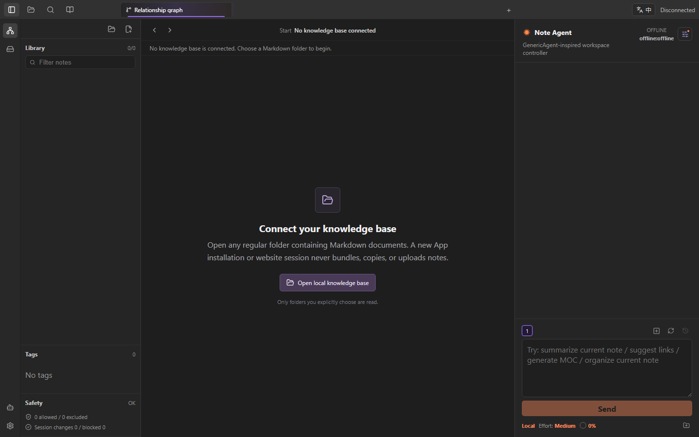

# Personal Knowledge Agent

**Documentation language:** [简体中文](README.md) | [English](README_EN.md)

## English Introduction

Personal Knowledge Agent is a local-first knowledge workspace for Windows and the Web. It brings file organization, knowledge relationships, Markdown reading and editing, and an AI note Agent into one focused three-column interface.

The product takes inspiration from Obsidian's local-file philosophy, wiki links, and graph navigation, but it is an independent application. It does not require a proprietary database or lock notes into a private format. Any regular Markdown folder can be opened directly, including an existing Obsidian vault. The files remain ordinary files that the user owns and can use outside this App.

## A Clean First Run



Every new desktop installation and every new website session starts with an empty workspace:

- No sample notes, test documents, or hidden knowledge base are bundled.
- No local folder is created automatically.
- No disk is scanned until the user explicitly selects a location.
- No API key, conversation history, or personal configuration is included.
- Only a folder deliberately selected by the user becomes part of the workspace.

Automated checks protect this contract. Missing desktop settings, unreadable settings, and unsupported browser folder APIs must all result in zero loaded documents, never fallback content.

## What It Solves

Large personal knowledge collections usually face three different problems. Folder trees explain where a file is stored but not what role it plays. Conventional node graphs show connections but often fail to explain why they matter. General chat tools can discuss text, yet they rarely understand the real file structure and the risks of changing it.

Personal Knowledge Agent separates these concerns into five complementary views:

1. **The file tree answers “where is it stored?”** It preserves real folders, hierarchy, filtering, and tags.
2. **The file relationship graph answers “which documents are explicitly connected?”** It is built from traceable Markdown wiki links.
3. **The tag knowledge map answers “what is it, what appears with it, and where can it be applied?”** It turns document tags into a three-dimensional knowledge cloud with classification, connection, application, and source domains.
4. **The knowledge canvas answers “how do these pieces form one idea?”** It combines text cards, tables, live note references, topic groups, and semantically labeled relationships.
5. **Note Agent answers “what should I understand or do next?”** It reads approved context, proposes changes, and executes authorized tools within local permission boundaries.

## Connect Real Files


Open Storage from the folder icon in the upper-left corner.

### Windows Desktop App

- Open an existing Markdown folder from any local drive.
- Create a new knowledge-base folder in a selected disk location.
- Remember the most recently connected path and restore it on the next launch.
- Browse local disk structure and preview supported files in read-only mode.
- Create, edit, rename, move, delete, and restore files inside the connected knowledge base through controlled App actions.

### Web App

- Open a user-authorized local folder through the Chrome or Edge directory picker.
- Enter `owner/repo` or a GitHub repository URL to load any public Markdown repository read only.
- Reuse the same safety filter, file tree, wiki-link parser, graph, tags, and reading interface for GitHub sources.
- Keep GitHub sources read only: create, edit, rename, delete, Agent diff application, and write-back are disabled.
- Parse files in the current browser session without uploading them to this project's server.
- Start empty again in a new browser session; note content is not stored as bundled website data.

The Web App cannot provide unrestricted disk access, operating-system secret storage, or the same background file monitoring as the desktop App.

### Public Demonstration Knowledge Base

The main product contains no demo notes. To evaluate a complex graph, open Storage and choose **Open official example knowledge base**, or use the [public demo link](https://personal-knowledge-agent.pages.dev/?repo=yrupeechalco-cell%2Fknowledge-agent-public-demo-vault&lang=en).

The demonstration content is maintained in the separate [`knowledge-agent-public-demo-vault`](https://github.com/yrupeechalco-cell/knowledge-agent-public-demo-vault) repository. It contains an original Chinese research collection about graph theory, network models, centrality, network dynamics, knowledge systems, and product experiments. External papers and standards are referenced by link and summarized in original notes; copyrighted full texts are not copied.

## The Three-Column Workspace


The desktop App and Web App render the same shared workspace. Their interface and graph behavior stay aligned; only their operating-system permissions differ.

### Left: Files, Tags, and Safety

The left column mirrors the real Markdown folder structure:

- Collapsible folders preserve parent-child storage hierarchy.
- Large structural folders and ordinary notes use distinct visual weight.
- Search filters titles and paths quickly.
- Local sources support context actions for creating, renaming, copying, cutting, pasting, and deleting.
- Tags show actual indexed tags rather than invented categories.
- Safety status reports allowed, excluded, changed, and blocked items.

The file tree owns storage structure. It does not compete with the graph by pretending to explain semantic influence.

### Center: Tag System and File Relationships

The center column provides two independent graph perspectives.

**Tag system** is the classification view. Tags from every document become a three-dimensional knowledge cloud. A sphere's base size represents its whole-collection weight and stays stable across the classification, connection, application, and source domains. Domains change layout and rim emphasis without rewriting that global weight. Selecting a sphere opens a two-dimensional root map of questions, evidence, decisions, outputs, and background documents.

**File relationships** are the explicit-document view. The graph is derived from `[[wiki links]]`, backlinks, and unresolved concepts. It does not infer strong connections from folder proximity.

Graph interactions include:

- Drag empty space to pan the full canvas.
- Use the mouse wheel for smooth pointer-centered zooming.
- Drag individual nodes with lightweight physical easing.
- Hover a node to dim unrelated content and emphasize direct relationships.
- Fade labels gradually as their real rendered size becomes unreadable.
- Preserve graph position and zoom when changing views.
- Hover a tag sphere to dim unrelated knowledge and highlight direct relations in purple.
- Hold `Ctrl` and drag with the left mouse button in the file graph to select multiple file nodes for a batch delete flow.
- Fit every node into view, reset the camera, cluster by top-level folder, and use a minimap to understand the current viewport.

### Knowledge Canvas

The knowledge canvas is for authoring explicit relationships instead of asking the graph to guess them. It supports text cards, tables, live references to real Markdown notes, topic groups, and labeled edges for related, supporting, contradicting, dependent, and reference relationships. Users can pan, zoom, select, resize, fit content, and undo or redo changes.

The desktop App stores canvas metadata in `.knowledge-agent/canvas.json` inside the current knowledge base without rewriting note bodies. Public GitHub repositories and read-only disk structures expose the canvas as read only.

## Reading, Editing, and Local Context


Opening a note switches the center area to its reader or editor:

- Browser-like tabs keep multiple documents open.
- Markdown reading and editing modes can be changed without leaving the workspace.
- A miniature relationship graph stays attached to the current note.
- Related documents keep labels while unrelated nodes remain as low-contrast points.
- Unresolved concepts use a subdued dashed treatment and can become new note drafts.

The miniature graph explains the immediate neighborhood of the current article. It does not replace the whole-collection tag system.

## Note Agent

Note Agent is a controlled knowledge-work console, not an unrestricted system shell.

### Context and Independent Sessions

- Read the current note, user-attached notes, and a bounded knowledge-base overview.
- Show a live context estimate based on the actual conversation, note attachments, current note, and overview.
- Run multiple numbered sub-agent conversations with isolated messages and execution state.
- Left-click a number to switch sessions and right-click it to remove that session.
- Reset a conversation while keeping a recoverable snapshot; restore both messages and context memory later.
- Keep the rest of the App interactive while a model task is running.
- Dock, float, hide, or focus the Agent panel. An empty idle panel collapses automatically and stays open after the user deliberately restores it.

### Tools and Permissions

The Agent can search and read notes, summarize, propose links, create drafts, organize documents, generate an MOC, open graphs, and execute explicitly authorized file tasks.

It does not receive unlimited Bash or arbitrary computer-control access. Every read, write, delete, and restore operation passes through App tools and path validation:

- Read-only navigation tools can run directly.
- New or edited notes enter the change and autosave workflow.
- An explicit create or delete instruction in the conversation can authorize the matching Agent tool without a second manual deletion dialog.
- A manual user deletion still requires visual confirmation.
- Deleted local files move into `.knowledge-agent-trash` for 30 days and can be restored after Agent review.
- Read-only disk browsing disables content access and all Agent write operations.

DeepSeek V4 Pro and DeepSeek V4 Flash are the current default model targets. Every user supplies their own API key. The Windows App encrypts it for the current Windows account with DPAPI instead of writing plaintext into the knowledge base, project, installer, or GitHub. Users can rotate, validate, or delete the credential and inspect its latest validation time.

## Write, Delete, and Restore Behavior

The desktop App edits the real folder that the user connects. Safety behavior depends on how an action was initiated:

| Action | Default behavior |
| --- | --- |
| Read and search | Runs immediately without changing files |
| Create and edit | Recorded as session changes and saved through the permitted desktop path |
| Manual delete | Requires a confirmation dialog |
| Explicitly authorized Agent delete | Executes after conversation authorization without repeating the manual dialog |
| Delete result | Moves to `.knowledge-agent-trash` for 30 days |
| Restore | Returns the original path and content after Agent review |
| Sensitive path | Blocked from indexing, write-back, and commit workflows |

Trash expiry uses real UTC millisecond timestamps. Cleanup happens only after 30 actual days, preventing visible time and deletion time from drifting apart. A dedicated Trash workspace shows the real `.knowledge-agent-trash/files` copy location, remaining retention time, a read-only preview, and the restore destination.

## Update Trust and Control

The Windows update settings show the current version, publisher, signature-verification policy, and release notes, and allow startup checks to be disabled. The client only installs GitHub Release artifacts that pass its embedded public-key verification. The signing private key exists only as an encrypted GitHub Actions secret and is never committed to the project.

## Default Safety Boundary

Sensitive and tool directories such as `.git`, `.obsidian`, `.claude`, `.venv`, `node_modules`, `.env`, `secret`, `token`, password, and account paths are excluded by default.

The project is designed to ensure that:

- User API keys are never bundled or uploaded.
- A real private knowledge base is never uploaded automatically.
- Local paths, personal vaults, conversations, and private project memory are excluded from public packages.
- Web deployments scan generated bundles for API-key patterns, private-key markers, Windows user paths, and private test-vault paths before upload.
- Desktop updates use a signed manifest and are accepted only after public-key verification.

## Desktop App and Web App

| Capability | Windows App | Web App |
| --- | --- | --- |
| Empty first run with no bundled notes | Yes | Yes |
| Open a user-authorized Markdown folder | Yes | Yes |
| Read a public GitHub Markdown repository | Not yet | Yes, read only |
| Create a knowledge-base folder anywhere | Yes | No |
| Direct disk write and file watching | Yes | Limited by browser permissions |
| Browse disk structure read only | Yes | No |
| Store a model key in local App configuration | Yes | No desktop secret store |
| Shared three-column UI and graphs | Yes | Yes |
| Signed automatic updates | Yes | Website updates automatically |

Main website: [https://personal-knowledge-agent.pages.dev/](https://personal-knowledge-agent.pages.dev/?lang=en)

## Getting Started

### Windows

1. Download the latest `x64-setup.exe` from [GitHub Releases](https://github.com/yrupeechalco-cell/personal-knowledge-agent-generic-agent-base/releases).
2. Install and open the App. The first launch contains no notes.
3. Use the folder icon to open an existing folder or create a new knowledge-base folder.
4. Open a note to use the file tree, graphs, editor, and local relationship view.
5. To use an online Agent, choose a model in the right panel and enter your own DeepSeek API key.

### Web

1. Open the [main website](https://personal-knowledge-agent.pages.dev/?lang=en) in an up-to-date Chrome or Edge browser.
2. Open Storage from the folder icon.
3. Choose a local Markdown folder or enter a public GitHub repository URL.
4. Choose the official example only when you want a complex demonstration collection.
5. Closing the page ends the in-memory index and local folder permission session; it does not turn those notes into website content.

See the [English User Guide](docs/USAGE_GUIDE_EN.md) for detailed operation and the [privacy and installation notes](docs/AGENT_INSTALL_AND_PRIVACY.md) for local data boundaries.

## Current Scope

- The daily-use desktop client currently targets Windows x64.
- Notes are ordinary Markdown with common Obsidian-style wiki-link compatibility.
- GitHub OAuth, real-time collaborative editing, and automatic cloud sync are future work.
- Git-based collaboration currently evolves through local Git, commits, pushes, and pull requests.

## Development and Verification

```bash
npm install
npm run dev:web
npm run tauri:dev
npm run typecheck
npm test
npm run build
npm run tauri:build
npm run deploy:web
```

```text
apps/desktop        Tauri desktop entry: local files, settings, model key, write-back
apps/web            Browser entry: authorized local folders and public GitHub repositories
packages/workspace  Shared three-column workspace and clean first-run flow
packages/core       Markdown, wiki links, tags, graphs, and safety rules
packages/agent      Note Agent, tool loop, model providers, and permissions
packages/ui         File tree, editor, whole-vault graph, and miniature graph components
```
