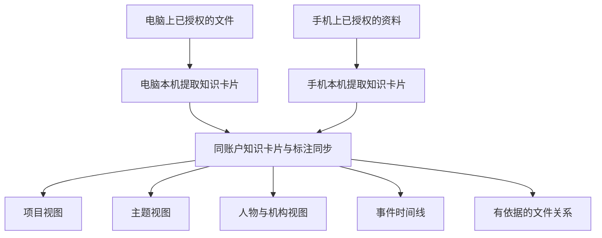

# 设备文件上的多维知识视图：产品与实施方案

状态：2026-09-27 更新。按用户最新要求，产品主线调整为“同一账户的标注数据互通与跨设备资料联想”。下文的账户同步、关系引擎与原生 iOS 接入属于下一阶段设计，尚未实现。技术取舍见 [Spacedrive 源码研究](SPACEDRIVE_RESEARCH.md)。

## 一句话定义

实施进度：0.3.5 已开始电脑端知识卡片试用，包含独立编号、本机标注、共享范围及白名单快照导出；账户同步、关系推荐及跨设备移动定位仍待实现。具体边界和回滚见 [电脑端卡片说明](DESKTOP_KNOWLEDGE_CARDS.md)。下文引用 0.3.4 的部分是研究时的基线描述。

用户选择设备上的资料范围，App 给这些资料建立独立的知识卡片，保存标记、摘要和关系。同一账户的设备共享卡片，帮助用户联想到自己在其他设备上的资料。原文件保留原位置，真正需要使用或融合原件时，由用户连接设备或专门传递文件。

这就是用户所说的“文件滤镜”。更准确的产品描述是：**一份原始资料，多种知识视图。**

## 用户会怎样使用

例如一个项目的文件分布在电脑和手机上：报价表、需求文档、会议录音、现场照片、演示视频。

| 查看角度 | App 展示的内容 |
| --- | --- |
| 按项目 | 这个项目涉及的所有格式、所有已配对设备的资料 |
| 按人物或机构 | 提到同一客户、成员或公司的文档与会议片段 |
| 按主题 | 分散在不同项目中的预算、进度、交付等材料 |
| 按时间 | 需求提出、讨论、变更、交付的事件线，注明日期来源 |
| 按用途或状态 | 合同、参考材料、灵感、待处理、已确认等 |
| 按关系 | 某文档引用了什么、附件属于哪次会议、哪里出现不同结论 |

切换视角只改变 App 内展示；不移动文件，不建立一堆实体副本。一个文件可以同时属于多个视图。用户可把常用组合保存为视图，例如“项目甲 + 预算 + 最近三个月”。

## 必须分清的三个概念

1. **标记**描述一个文件：主题、项目、参与者、用途、状态、日期。采用可组合的字段，不把所有信息挤成一棵分类树。
2. **关系**连接文件或内容片段：引用、附件、前后版本、同一事件、支持或存在差异。每条关系说明原因。
3. **视图**是保存下来的查询条件：同一份索引可以生成列表、时间线、项目资料集、图片网格和局部关系图。

“同属一个项目”可由共同项目标记直接计算，无须让所有文件互相连线。相似度只是找候选资料的依据，不自动等于引用、因果或事实关联。

## 产品结构

### 1. 资料来源

- 电脑：用户选定的文件夹，监测新增、修改、移动、删除和权限变化。
- 手机：原生 iOS 的文件夹授权、系统文件选择器、相册授权与系统分享入口。
- 当前手机网页：继续提供选择文件、保存副本与浏览已同步目录；它的能力不能直接等同于原生文件夹授权。
- 所有格式首先可以做文件名、类型、大小、来源、时间及手动标记；能否理解内容取决于相应解析器。
- 文件暂时离线时保留卡片，显示“原文件在电脑”“最后同步时间”等状态，禁止把打不开说成已删除，也不声称知道未同步的新内容。

### 2. 知识标记

- 起步提供主题、项目、人物/机构、用途、状态、事件日期六类字段，允许多选。
- 人工标记、规则生成、AI 建议分别记录来源，人工确认的内容可以锁定。
- 同义词可归一，例如简称与全称；同名人物/项目需要区分，不能凭名字强行合并。
- 标记和关系保存在 App 的独立索引中；默认不写入文件正文、文件名、EXIF 或系统标签。
- “改标记”和“修改原文件”是独立操作。现有正文编辑能力保留明确的保存与撤销机制。

### 3. 文件与片段关系

- 第一批：手动关联、同项目、同主题、显式引用、确定的相同内容。
- 后续：版本链、同一事件、语义相似、支持/矛盾候选。
- 每条推断关系保存依据：本机原文摘录、PDF 页码、录音或视频时间段，以及源文件版本。跨设备默认共享定位和解释，原文摘录需另行选择；基于卡片得到的推断明确标注“依据摘要与标记”。
- 页面明确区分“人工确认”“规则发现”“AI 建议”。AI 的自评分数不当作事实正确率。
- 原内容发生变化后，相关推断标记为待复核；用户可确认、拒绝和撤销，拒绝结果用于避免反复推荐相同错误。

### 4. App 界面

- 左侧入口：资料、视图、关系、待整理、设备与同步。
- 中间显示当前视图，顶部只切换角度与筛选条件；遵循已有偏好，不为每个功能增加一个顶栏页签。
- 右侧详情展示来源、标记、摘要、知识 tip、关联文件和证据。
- 关系图默认围绕当前文件或资料集展开，可按关系类型筛选；也提供容易阅读的关联列表。
- 手机优先使用列表、标记筛选和关联卡片，复杂关系图作为辅助入口。

## 文件很大时怎么办

建立标记与关系不必把原文件复制到所有设备。产品的日常同步只处理知识卡片：

- **知识卡片同步**：资源编号、名称、标签、允许共享的摘要、关系、证据定位和原文件所在设备，在同一账户的已授权设备间同步。
- **原文件取用**：用户实际需要读全文、编辑或合并时，再连接设备、使用外部传递工具，或单独明确发起原件传递。查看卡片、打标和联想不触发原件传输。
- **同步字段白名单**：不携带正文、附件、全文 OCR/转写、绝对路径或本机授权凭据；“仅本机”资料不进入卡片同步。名称和摘要也属于用户资料，需纳入同步范围选择。

大视频可以先通过文件信息和手动标记进入视图；需要内容理解时，再分阶段做音轨转写、代表帧分析和时间段关联。显示“未分析、分析中、部分完成、已完成”，不把仅登记文件名当作理解了整个视频。

当前 0.3.4 仍是“手机导入后自动上传、电脑附件打开时下载”，文字快照也包含正文。它尚不符合这次收敛后的标注互通边界；需要新增卡片协议并调整默认行为。本轮研究未改动已安装软件。

## AI 的位置

继续使用现有模型调用和 Agent 接口，优先完善以下能力：

1. 从文本中提取有引用依据的摘要、知识 tip、项目和参与者候选。
2. 使用共享卡片的关键词、摘要、已确认字段与语义检索寻找跨设备关联候选；原件未取用时不检索或读取远端全文。
3. 对候选关系生成原因与证据，进入待确认列表。
4. 用户用自然语言询问时，将问题转为视图条件或卡片检索请求。说明相关原因、依据范围与原件所在设备，需要全文核对时再引导用户取用原件。

日常扫描、索引、同步和错误恢复由固定程序流程完成。Agent 提供查询与整理建议；文件移动、覆盖、删除不交给自主推理过程直接执行。

关系只在 App 展示，与内容是否送往在线模型是两个需要分别配置的范围。若用户要求内容完全留在设备，采用本地模型；使用在线模型时明确展示要发送的文件片段及处理范围。GitHub 只保存程序源码与合成测试资料，不保存用户知识库。

## 技术底座建议

### 资源身份与本机位置分离

当前文件索引主要用“根目录 + 相对路径”作编号。下一阶段先引入稳定资源 UUID，位置另存，才能处理跨设备、重命名和迁移：

| 数据 | 含义 |
| --- | --- |
| Resource | 逻辑资料编号、标题、格式、当前版本 |
| Location | 设备、授权来源、本机路径或系统文件标识；同步时只发送设备信息、位置引用与最后观测状态 |
| Revision | 内容版本、修改时间、大小、可选完整哈希 |
| Annotation | 字段、值、来源、确认/拒绝状态、对应内容版本 |
| Entity | 项目、人物、机构、事件等对象及别名 |
| Relation | 两端资源/片段、关系类型、确认状态与证据 |
| Fragment | 文字段落、页码、音视频起止时间及解析版本 |
| SavedView | 可组合筛选条件、排序和展示方式 |
| Change | 设备操作编号、变更内容、基准版本和同步状态 |
| AccountDevice | 个人账户、已授权设备、撤销状态与同步范围 |

文件哈希用于验证完整性和识别相同内容；不把哈希作为会随每次编辑变化的唯一资源身份。重复文件可展示为候选副本，自动判定不明确时保留独立资源供用户确认。

### 存储与同步

- 电脑端建议将当前 JSON 索引渐进迁移到 SQLite，保存字段、关系、全文索引和变更日志；先保留可回滚的原索引快照。
- 网页试用端继续 IndexedDB；原生 iOS 使用本机数据库，二进制缓存单独保存。
- 使用同一套资源编号和标记规则，文件状态由持有设备报告，人工标注允许各已授权设备编辑。编辑标注不要求原件在线。
- 标记的并发新增可合并；同一字段发生冲突时保留双方值供确认；删除使用删除记录而非简单丢弃。
- 原文件编辑与显式传递沿用版本检查和保留副本，独立于卡片同步流程。
- 推荐轻量的个人账户卡片中继，配合受保护的传输、账户隔离和本机缓存，使各设备不必同时在线。原文件不进入该服务；不自行设计密码算法。
- 局域网通道先用于卡片协议验证；完整同账户体验还要补齐账户服务、设备登记、撤销、密钥恢复及稳定 HTTPS 手机入口，不能把现有二维码配对称为账户同步。多人协作不在首轮范围。
- 不需要先引入独立图数据库服务。先在本机关系表上实现可解释的关联查询，再按实际规模决定扩展。

## 当前项目已经做到哪里

根据 `library.rs`、`libraryModel.ts` 与 `apps/web/src/mobile` 的现有实现：

- 已有：用户选定目录的文件索引；App 内分类、标签、摘要和带引用的知识 tip；分类锁定；文本 AI 整理；原文修改的版本检查；手机本机库及局域网同步。
- 0.3.4 已通过本机浏览器与正式安装包验收：图片、音频、视频保存、预览、导出及分块原文件同步，取消固定附件大小限制；iPhone 真机仍需用户复验。
- 仍需新增：稳定跨设备资源编号；专用知识卡片同步协议；个人账户与设备服务；独立维度字段；实体与关系数据库；保存视图；片段证据；图片 OCR/音视频转写；原生 iOS 文件夹接入。
- 已有笔记图谱和画布不等同于完整的跨设备文件关系引擎。可以复用其中的 UI，但需要统一资源身份与关系数据。
- 当前索引有 1500 文件、正文 1 MB/文件、正文索引 16 MB 等边界。下一阶段需要通过数据库、分页和分段解析设计扩容，并用目标数据集验收；不能只改数字宣称可管理任意规模。

## 推荐实施顺序

### 第一阶段：把资料卡与原件分开

稳定资源编号、索引迁移、主题/项目等字段、卡片协议、人工标注变更记录，以及文件移动后修复位置。卡片模式的浏览和编辑不触发正文写回或原件传输。

交付标准：分类与标记只影响 App 索引；同步载荷严格限定为允许的卡片字段，并通过网络记录及原件哈希验证。

### 第二阶段：同账户卡片互通

账户与设备身份、卡片变更中继、稳定手机入口、本机缓存、离线队列与冲突处理。先把电脑卡片到手机、手机标注返回电脑的流程做完整。

交付标准：电脑关机后手机仍可查看已同步卡片，电脑重连后收到手机标注；不同账户互不可读，修改不丢失，原文件仍在原设备。

### 第三阶段：多维视图与有依据的联想

项目/主题/人物等组合筛选、保存视图、人工关联、卡片语义检索与待确认的 AI 关系。继续使用现有模型接口，先完善文字卡片，随后增加本机图片识别、音视频转写与证据定位。

交付标准：每条 AI 关系说明依据范围与版本；人工修正可靠保留，不把只看过摘要说成读过原件。

### 后续补齐手机资料接入

制作原生 iOS 客户端，接入文件夹授权、相册选择、分享入口和本机索引。支持权限撤回、文件提供方离线和书签失效后的重新授权。原件取用由用户单独发起。

Apple 的目录选择器可以授予所选目录及子目录访问，并保存访问书签；授权范围和文件提供方的可用性仍由系统管理。[Apple 官方目录访问说明](https://developer.apple.com/documentation/uikit/providing-access-to-directories)。

## 先用这些场景验收

1. 同一文件同时出现在“项目甲”“客户乙”“预算”三个视图，磁盘上没有新增副本。
2. App 中改分类和关联后，对比原路径、修改时间、内容哈希，均保持不变。
3. 在资源管理器重命名或移动文件后，已确认标签与关系保留；无法确定身份时提示重新定位。
4. 电脑给文件打标，手机收到一致标记；原文件未下载时仍能浏览资料卡并看见所在设备。
5. 查看、打标、联想时的网络记录只包含允许的卡片字段；没有附件字节、正文或全文转写。用户单独发起原件传递时才处理文件内容。
6. 手机和电脑离线分别修改标记，联网后不丢失修改；互相冲突的字段可以确认。
7. 人工构造两个同名人物，系统不错误合并；构造主题相似但无引用的文件，不把相似说成引用。
8. 修改原内容后，相应 AI 关系显示待复核；删除 App 内关联不删除原文件。
9. PDF、图片、录音、视频分别能显示已完成和未完成的解析部分，并定位到证据。
10. 使用用户自选的一个真实项目检验：能否快速从不同目录和设备找到相关资料，是否比原文件夹更容易完成实际工作。
11. 电脑离线时仍能查看最后同步的资料卡及时间；不同账户无法访问彼此卡片；本机专用资料不发送。

## 判断是否值得继续

值得做，现有目录索引与独立分类已提供基础。价值应通过“找资料更快、关联有依据、人工修正可靠、原文件稳定”验证。下一轮建议先实现第一阶段，再用真实资料检验，不把视图数量或关系连线数量当成产品成功标准。
